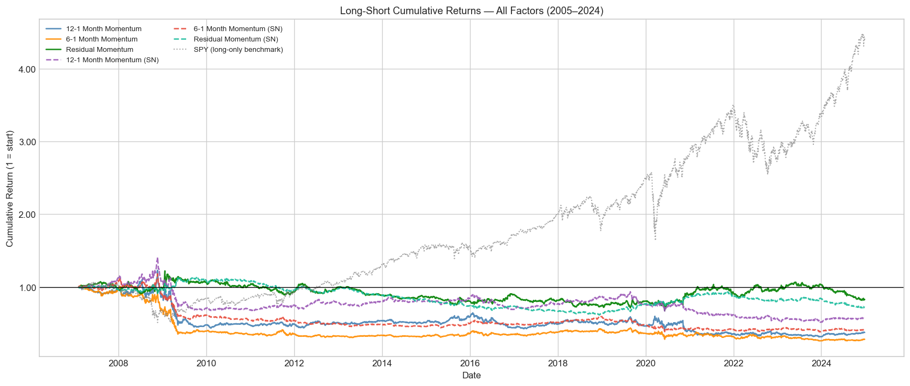
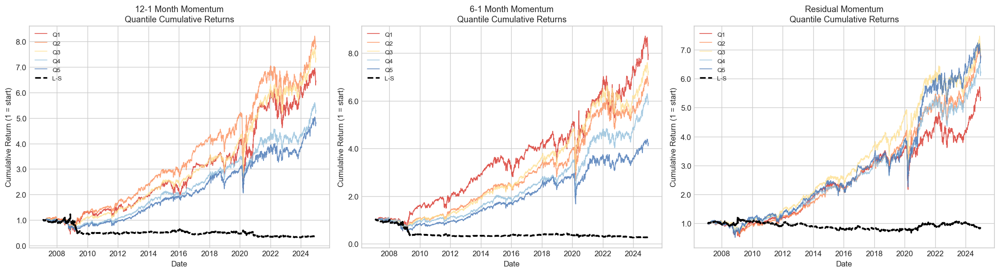
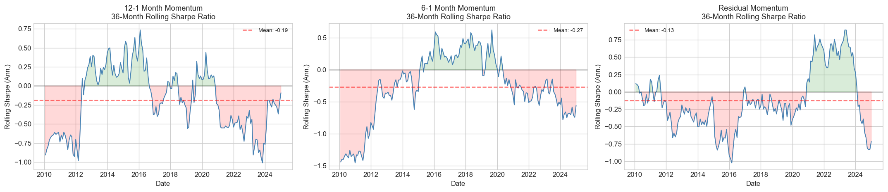

# cross-sectional-momentum-factor-library

A production-quality Python library for computing, backtesting, and rigorously
evaluating **classic cross-sectional equity momentum factors** on a universe of
~150 large-cap US equities (2005–2024).

The library implements three momentum signals (12-1 month, 6-1 month, and
residual momentum), runs monthly long–short quantile backtests with
realistic transaction costs, and produces a comprehensive research report
via a fully executable Jupyter notebook — including Fama-French five-factor
regression, rolling Sharpe analysis, sub-period breakdowns, and
Bonferroni/BH multiple-testing corrections.

---

## Quick Start

```bash
pip install -r requirements.txt
```

```python
import config
from src.data_loader import fetch_price_data, fetch_risk_free_rate, fetch_sector_map
from src.universe import apply_universe_filters
from src.backtester import MomentumBacktester

# Fetch data
prices = fetch_price_data(config.UNIVERSE_TICKERS, config.START_DATE, config.END_DATE)
benchmark = fetch_price_data([config.BENCHMARK], config.START_DATE, config.END_DATE).squeeze()
risk_free = fetch_risk_free_rate(config.START_DATE, config.END_DATE)

# Build universe and run backtest
universe = apply_universe_filters(prices)
bt = MomentumBacktester(prices, benchmark, risk_free, {}, universe, config)
results = bt.run("mom_12_1", n_quantiles=5)
print(results["long_short"].cumsum().plot(title="12-1 Momentum Long-Short"))
```

For the full research report (all factors, charts, regression tables), launch
the notebook:

```bash
jupyter lab notebooks/full_research_report.ipynb
```

---

## Project Structure

```
cross-sectional-momentum-factor-library/
├── README.md
├── requirements.txt
├── config.py                  # Global constants and universe tickers
├── data/                      # Empty — data fetched at runtime
├── src/
│   ├── __init__.py
│   ├── data_loader.py         # yfinance price/RF/sector data fetching
│   ├── universe.py            # Point-in-time universe filtering
│   ├── factors.py             # Momentum signal computation (no look-ahead)
│   ├── backtester.py          # Monthly long–short quantile backtester
│   ├── portfolio.py           # Equal-weight and optimised portfolio construction
│   ├── analytics.py           # Performance stats, FF regression, multiple testing
│   └── utils.py               # Shared helper utilities
├── notebooks/
│   └── full_research_report.ipynb   # End-to-end research report
└── tests/
    ├── test_factors.py
    └── test_backtester.py
```

---

## Methodology

### Factor Definitions

| Factor | Definition |
|--------|-----------|
| **12-1 Momentum** | Cumulative return from t−252 to t−21 trading days (skip most recent month to avoid short-term reversal) |
| **6-1 Momentum** | Cumulative return from t−126 to t−21 trading days |
| **Residual Momentum** | Cumulative OLS residual from regressing daily stock excess returns on benchmark excess returns over t−252 to t−21; captures idiosyncratic momentum after removing market-beta |

### Backtest Rules

- **Universe**: ~150 S&P 500 large-caps present before 2005; filtered monthly for minimum 2 years of history and price ≥ $5.
- **Rebalance**: Last trading day of each calendar month.
- **Signal date**: Rebalance date (strictly prior-data only — no look-ahead).
- **Execution**: Positions entered at the **next trading day's close** after signal date.
- **Portfolio**: Equal-weighted long (top quintile) minus equal-weighted short (bottom quintile).
- **Transaction costs**: 10 bps one-way, applied to gross portfolio turnover.
- **Sector-neutral variant**: Quantile sorting is done within each GICS sector; eliminates sector timing.

### Statistical Analysis

- Annualized return, volatility, Sharpe ratio, maximum drawdown, Calmar ratio, Sortino ratio.
- Fama-French 5-factor + UMD momentum regression with HAC (Newey-West) standard errors.
- Rolling 36-month Sharpe ratio plots.
- Sub-period analysis (pre-GFC, GFC, recovery, pre-COVID, COVID crash, post-COVID).
- Multiple-testing corrections: Bonferroni and Benjamini-Hochberg FDR.

---

## Results Preview

### Cumulative Returns (2005–2024)


### Quantile Portfolio Spread


### Rolling 36-Month Sharpe Ratio



---

## Limitations & Disclaimers

1. **Survivorship Bias**: The ticker universe contains only companies that
   survived to be current S&P 500 members. Firms that went bankrupt, were
   delisted, or were acquired between 2005 and 2024 are excluded, which
   overstates backtest returns relative to a true live strategy.

2. **Transaction Costs**: A flat 10 bps one-way cost is a simplification.
   Real momentum strategies incur market impact, bid-ask spreads, and
   borrowing costs (for the short leg) that vary with trade size and liquidity.

3. **Data Quality**: yfinance adjusted-close prices may contain errors or
   inconsistencies due to incorrect split/dividend adjustments. For production
   use, verify data against a commercial provider (e.g., Refinitiv, Bloomberg).

4. **No Shorting Constraints**: The backtest assumes frictionless shorting.
   In practice, many small/illiquid stocks are hard to borrow.

5. **Look-Ahead Free by Construction**: Every factor signal is computed using
   only data strictly before the rebalance date. Assertions in `factors.py`
   and `backtester.py` enforce this, but users extending the library should
   remain vigilant.

6. **Not Investment Advice**: This library is for research and educational
   purposes only. Past backtest performance does not predict future results.

---

## Running Tests

```bash
pytest tests/ -v
```

---

## License

MIT License. See [LICENSE](LICENSE) for details.

---

## Extending the Library

Suggested directions:

- Add Fama-French factor data as portfolio benchmark legs.
- Implement 52-week high momentum (George & Hwang, 2004).
- Add industry momentum (Moskowitz & Grinblatt, 1999).
- Incorporate short-term reversal (t−21 to t−0) as a separate factor.
- Connect to a survivorship-bias-free data provider (CRSP, Compustat).
- Implement risk-parity portfolio weighting via `portfolio.py`.
